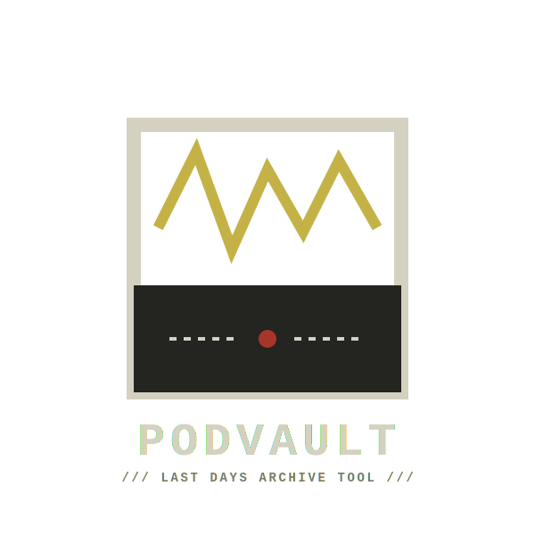
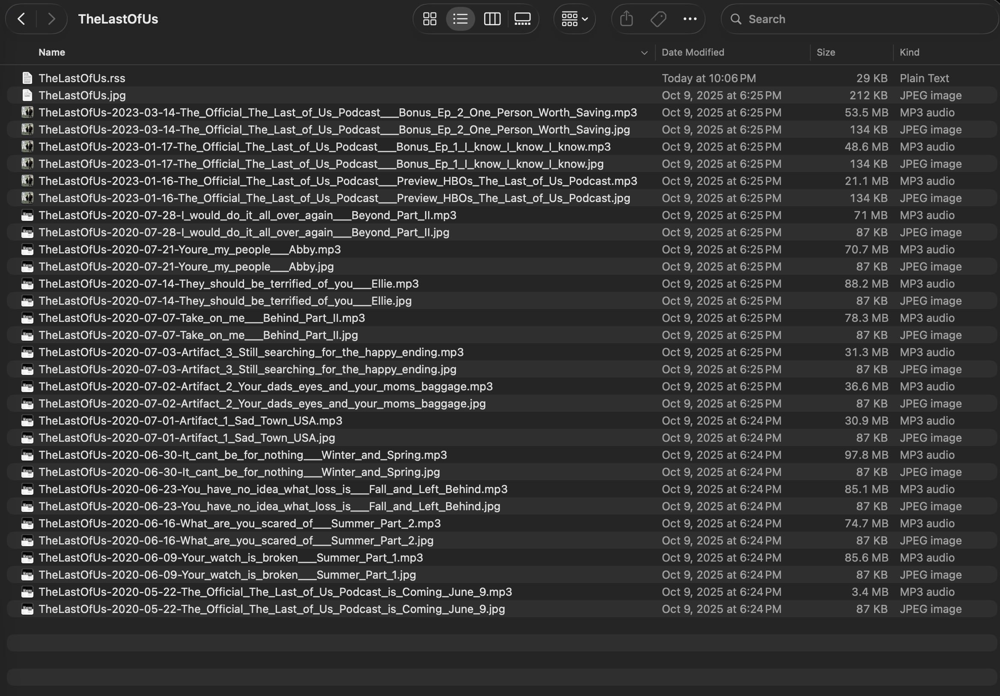
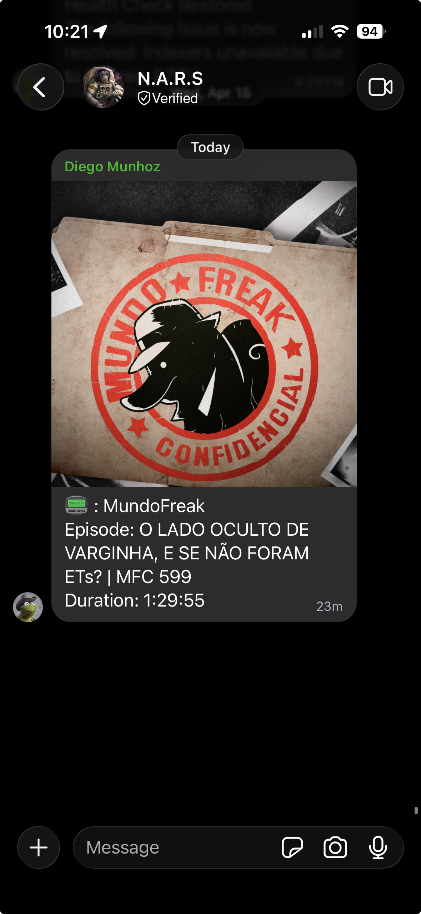

<p align="center">
  
  <br>
  
  <a href="https://ko-fi.com/diegomunhoz">
    
  </a>
</p>

<p align="center">
  <strong>PodVault</strong> is a resilient tool designed to monitor podcast RSS feeds, download new episodes, and archive them locally. It handles transcoding, metadata tagging, and high-quality artwork embedding, with optional Signal notifications to keep you updated.
</p>

## The Mission: Preserve the Record

Lately, things are disappearing from the internet all over the place. Platforms shut down, RSS feeds break, and content that was "available forever" vanishes overnight. 

I built **PodVault** to help you keep a little piece of the record for yourself, before it is all lost. Most RSS downloaders are either too simple or way too bloated; I wanted a "set and forget" archive protocol that:

1. **Actually Persists:** It has 30s timeouts and robust retry logic with exponential backoff to handle unstable servers.
2. **Prioritizes Quality:** It detects source formats to avoid redundant transcoding (saving CPU and preserving audio fidelity).
3. **Stays Resilient:** Uses proper connection pooling and context managers to avoid resource leaks during long-term operation.

## What it actually does
- **Monitors RSS feeds:** Automatically checks your defined podcasts on a configurable loop.
- **Smart Transcoding:** If an episode is already an MP3, it downloads it directly; otherwise, it uses FFmpeg to convert it to high-quality MP3.
- **Metadata Fixer:** Cleans episode titles and show names, writing proper ID3 tags for a perfect local library.
- **Artwork:** Fetches show or episode covers, resizes them to 3000x3000px, and embeds them directly into the MP3 metadata.
- **Notifications:** Optional Signal messages with episode details and cover art once a download is complete.

## Roadmap: The Future of the Vault

Planned enhancements to the PodVault archive protocol:

- [ ] **Hash-based Deduplication:** Ensure absolute archival integrity by verifying file contents.
- [/] **Local RSS Generation:** (In-Progress) Generate a custom RSS feed from your local archive to point your podcast apps at your own private vault.
- [ ] **Naming Convention Config:** Allow users to define custom patterns for archived filenames and folders.
- [ ] **Web Dashboard:** A simple, searchable interface to browse and manage the local library.

## Configuration

The app looks for two files in a `config/` directory located in the same folder as the script.

### 1. `config.json` (Global Settings)
This file controls the behavior of the application itself and the notification system.

| Option | Required | Default | Description |
| :--- | :---: | :--- | :--- |
| `urlFile` | **Yes** | - | Path to your podcast list (e.g., `/config/urls.json`). |
| `checkInterval` | No | `300` | Minutes to wait between each full check of your podcast list. |
| `logLevel` | No | `"info"` | Sets verbosity. Options: `info`, `debug`, `warning`, `error`. |
| `notifySignal` | No | `false` | Enables Signal notifications. Requires an external container. |
| ↳ `notifyErrors` | No | `true` | If true, the bot will message you if the script crashes. |
| ↳ `signalSender` | No* | - | Your phone number (+12345...). *Required if `notifySignal` is true. |
| ↳ `signalGroup` | No* | - | Your Base64 Group ID. *Required if `notifySignal` is true. |
| ↳ `signalEndpoint` | No* | - | The URL of your Signal API container. *Required if `notifySignal` is true. |

**Minimal `config.json`:**
```json
{
    "urlFile": "/config/urls.json"
}
```

**Full `config.json` (With Signal):**
```json
{
    "urlFile": "/config/urls.json",
    "notifySignal": true,
    "checkInterval": 60,
    "notifyErrors": true,
    "logLevel": "info",
    "signalSender": "+15551234567",
    "signalGroup": "group.your_base64_group_id_here==",
    "signalEndpoint": "http://signal-api:9120"
}
```

### 2. `urls.json` (Podcast List)
This file defines which podcasts to monitor and how to filter them.

| Option | Required | Default | Description |
| :--- | :---: | :--- | :--- |
| `name` | **Yes** | - | Friendly name for the podcast (used for folder naming). |
| `url` | **Yes** | - | The RSS feed URL. |
| `monthsBack` | No | `1` | Only download episodes published within this many months. |
| `filter` | No | `false` | Set to `true` to enable keyword filtering. |
| ↳ `filter_Include` | No | `[]` | Keywords that MUST be in the title (logical OR). |
| ↳ `filter_Exclude` | No | `[]` | Keywords to skip (logical OR). |

**Example `urls.json` (Minimal):**
```json
{
    "podcast": [
        {
            "name": "TheLastOfUs",
            "url": "https://feeds.megaphone.fm/theofficialthelastofuspodcast"
        }
    ]
}
```

**Example `urls.json` (Full):**
```json
{
    "podcast": [
        {
            "name": "TheLastOfUsHbo",
            "monthsBack": 1,
            "url": "https://feeds.megaphone.fm/WMHY3005782945",
            "filter": false
        },
        {
            "name": "TheLastOfUs",
            "monthsBack": 1,
            "url": "https://feeds.megaphone.fm/theofficialthelastofuspodcast",
            "filter": false
        },
        {
            "name": "EndOfAllHope",
            "monthsBack": 10,
            "url": "https://feeds.simplecast.com/9nWOf4Xi",
            "filter": false
        }
    ]
}
```

## How to Use

### 1. Docker Deployment (Recommended)
Docker is the easiest way to run PodVault as it bundles FFmpeg and all dependencies.

**Run the container:**
```bash
docker run -d \
  --name podvault \
  --restart unless-stopped \
  -v /path/to/your/config:/app/config \
  -v /path/to/your/logs:/app/logs \
  -v /path/to/your/podcasts:/app/podcasts \
  ghcr.io/ddmunhoz/podvault:latest
```

**Alternative: Build locally**
```bash
docker build -t podvault:local .
```

### 2. Running Locally (Outside Docker)
If you want to run the script directly on your machine:

- **Requirements:** Python 3.13+ and FFmpeg must be installed and in your system PATH.
- **Setup:** Create a `config/` directory in the project root and place your `config.json` and `urls.json` inside it.
- **Install dependencies:**
  ```bash
  pip install -r requirements.txt
  ```
- **Run the app:**
  ```bash
  python3 podvault.py
  ```

## Directory Structure & Notifications

### Automatic Organization
PodVault manages the file system automatically. You don't need to create folders or manage image files:

```text
podcasts/
├── [Podcast Name A]/          <-- Matches "name" in urls.json
│   ├── Show-Date-Episode.mp3
│   └── Show-Date-Episode.mp3
└── [Podcast Name B]/
    └── Show-Date-Episode.mp3
```



- **Folders:** A sub-folder is created for each podcast using the `name` field from your `urls.json`.
- **Metadata/Art:** Images are fetched from the RSS feed and embedded directly into the MP3 metadata. No external `.jpg` files are stored.

### Signal Notifications
Signal notifications are entirely optional. If enabled, you'll receive notifications like this:

<a href="artifacts/signalNotifExample.png">
  
</a>

## License
Do whatever you want with it.

---

<p align="center">
  If PodVault helps you preserve your history, consider supporting the archive:
  <br><br>
  <a href='https://ko-fi.com/diegomunhoz' target='_blank'>
    
  </a>
</p>
